# Analyse des artefacts BIRD — release `version=2026-03-01`

**Source analysée** : `artefact bird.zip` (67 fichiers Parquet, ≈ 2,7 millions de lignes)
**Référentiel** : BIRD (Banks' Integrated Reporting Dictionary), publié par la BCE selon la méthodologie **SMCube** — https://bird.ecb.europa.eu/
**Méthode** : chargement DuckDB, description exhaustive des 67 fichiers, ~90 contrôles d'intégrité référentielle croisés (clés primaires, clés étrangères, fenêtres de validité, cohérence fonctionnelle).
**Date de l'analyse** : 2026-07-08

---

## 1. Vue d'ensemble

Le zip contient le **dictionnaire complet d'une release BIRD** : tout ce qu'il faut pour décrire, contrôler, transformer et restituer les données du reporting réglementaire bancaire, depuis la couche de collecte (Input Layer) jusqu'aux états réglementaires (FINREP, Asset Encumbrance, AnaCredit, SHS).

### 1.1 Acteurs (maintenance_agency — 5 agences)

| Agence | Rôle |
|---|---|
| **ECB** | Équipe SDD (Single Data Dictionary) — propriétaire du dictionnaire de référence et du modèle BIRD |
| **EBA** | European Banking Authority — propriétaire des taxonomies de restitution (FINREP, AE) |
| **ECB2** | Équipe SHS (Securities Holdings Statistics) |
| **ECB6** | Division Statistiques de supervision |
| **ECB14** | Jeux de données « Climate Change » (2 membres seulement) |

### 1.2 Cadres réglementaires (framework — 9 cadres, 2 146 cubes)

| Framework | Agence | Contenu | Cubes |
|---|---|---|---|
| **BIRD** | ECB | Les 4 couches du modèle d'entrée : LDM (557), IL (113), ELDM (600), EIL (114) | 1 384 |
| **EBA_FINREP** | EBA | Templates FINREP officiels (type D = « framework EBA ») | 344 |
| **FINREP_REF** | ECB | Version « référence » BCE des templates FINREP (type RC), cible de la génération | 251 |
| **EBA_AE** | EBA | Templates Asset Encumbrance officiels | 64 |
| **AE_REF** | ECB | Version référence des templates AE | 23 |
| **ANCRDT** | ECB | Cubes de collecte AnaCredit (granulaire, sans version _REF) | 10 |
| **SDD** | ECB | Méta-modèle du dictionnaire lui-même (packages Core, Mapping, Rendering…) | 62 |
| **ECB2_SHS** / **SHS_REF** | ECB2/ECB | Securities Holdings Statistics (collecte + référence) | 4 + 4 |

### 1.3 La chaîne de valeur portée par les artefacts

```
LDM (modèle logique métier, 557 entités)
 └─ WUDEN (227 règles) ─► IL (Input Layer, 113 tables — ce que la banque charge)
ELDM (modèle logique enrichi, 600 entités)
 └─ WUDEN ─► EIL (Enriched Input Layer, 114 tables)
IL ─ DER (43 règles) ─► EIL (attributs dérivés/enrichis)
EIL ─ GEN (109 règles) ─► ROL / cubes _REF (FINREP_REF, AE_REF, ANCRDT)
cubes _REF ─ mappings E/A ─► templates EBA (FINREP, AE) ─► rendu tabulaire (lignes × colonnes × cellules)
```

Chaque flèche de ce schéma est matérialisée par des fichiers précis, détaillés en section 2 ; le graphe complet des dépendances est en section 3.

---

## 2. Contenu et utilité de chaque fichier

### 2.1 Gouvernance et cadre juridique

| Fichier | Lignes | Clé | Contenu et utilité |
|---|---|---|---|
| `maintenance_agency` | 5 | MAINTENANCE_AGENCY_ID | Registre des autorités qui maintiennent les objets. Racine de traçabilité : presque tous les fichiers portent une FK vers elle. |
| `framework` | 9 | FRAMEWORK_ID | Les cadres réglementaires (voir §1.2). Chaque cube appartient à un framework : c'est le premier axe de partition du dictionnaire. |
| `framework_variable_set` | 1 | (FRAMEWORK_ID, VARIABLE_SET_ID) | Rattache un jeu de variables à un framework. **Une seule ligne** : ANCRDT → `RECL_PSTL_CD` (codes postaux) — et ce jeu est cassé (voir incohérence T2). |
| `framework_hierarchy`, `framework_subdomain` | 0 | — | Prévu par le standard pour rattacher hiérarchies/sous-domaines à un framework. **Vides dans cette release.** |
| `legal_text` | 38 | LEGAL_TEXT_ID | Textes juridiques sources : IAS/IFRS, CRR, directives UE, Q&A EBA, Bâle. |
| `legal_reference` | 366 | (OBJECT_TYPE, OBJECT_ID, LEGAL_TEXT_ID) | Lien article-par-article entre un objet du dictionnaire (189 cubes, 127 membres, 50 variables) et sa base juridique. Utile pour justifier chaque concept devant le régulateur. |

### 2.2 Dictionnaire sémantique (le « vocabulaire »)

| Fichier | Lignes | Clé | Contenu et utilité |
|---|---|---|---|
| `domain` | 307 | DOMAIN_ID | Domaines de valeurs : 284 énumérés (listes de codes : secteur institutionnel, type d'instrument…) et 23 non énumérés (montants, dates, chaînes). Porte le type de données. |
| `member` | 22 137 | MEMBER_ID | Les **codes** eux-mêmes (22 137 valeurs possibles), chacun rattaché à son domaine. C'est la codelist globale multi-agences. |
| `variable` | 2 144 | VARIABLE_ID | Les **concepts** observables (colonnes potentielles) : chaque variable prend ses valeurs dans un domaine. Ex. `ACCNTNG_CLSSFCTN` → domaine `ACCNTNG_CLSSFCTN`. |
| `subdomain` | 2 522 | SUBDOMAIN_ID | Sous-ensembles d'un domaine valables dans un contexte donné (ex. « secteurs institutionnels admis dans ce template »). C'est le mécanisme de restriction contextuelle des codelists. |
| `subdomain_enumeration` | 43 501 | (SUBDOMAIN_ID, MEMBER_ID, VALID_FROM) | Composition datée des sous-domaines : quel membre appartient à quel sous-domaine, **sur quelle fenêtre de validité**. 5 104 couples portent plusieurs fenêtres (versionnage temporel propre, aucun chevauchement détecté). Base du contrôle `INVALID_CODE`. |
| `variable_set` | 2 557 | VARIABLE_SET_ID | Regroupements nommés de variables (dont 291 variantes `_REF` générées pour les cubes référence). |
| `variable_set_enumeration` | 3 616 | (VARIABLE_SET_ID, VARIABLE_ID) | Composition des jeux de variables, avec sous-domaine applicable et fenêtre de validité. |
| `facet_collection` | 117 | FACET_ID | Contraintes de format réutilisables (facettes) : longueurs, motifs, types (String, Decimal, GregorianDay…). Référencées par `domain` et `subdomain`. |
| `facet_enumeration` | 131 | (FACET_ID, FACET_TYPE) | Détail des contraintes : 103 `pattern` (regex), longueurs max, bornes min/max, décimales. C'est la matière des contrôles de format. |

### 2.3 Structures de données (les « tables »)

| Fichier | Lignes | Clé | Contenu et utilité |
|---|---|---|---|
| `cube` | 2 146 | CUBE_ID | L'objet central : toute structure de données (entité logique, table de collecte, template de restitution) est un cube, typé (LDM/IL/ELDM/EIL/C/D/RC) et rattaché à un framework et à une structure. |
| `cube_structure` | 2 146 | CUBE_STRUCTURE_ID | La structure d'un cube (relation 1:1 constatée dans cette release). Sert d'ancre aux items. |
| `cube_structure_item` | 23 355 | (CUBE_STRUCTURE_ID, CUBE_VARIABLE_CODE) | **Le schéma colonne par colonne** : chaque item = une colonne d'un cube, avec rôle (D dimension, O observation/mesure, A attribut), variable sous-jacente, sous-domaine de valeurs admises, caractère obligatoire. C'est le fichier qui permet de générer DDL, contrôles de complétude et grilles. |
| `cube_group` | 81 | CUBE_GROUP_ID | Groupes thématiques de cubes (packages SDD, familles ELDM « Party related », « Instrument related »…). |
| `cube_group_enumeration` | 1 454 | (CUBE_GROUP_ID, CUBE_ID) | Affectation des cubes aux groupes (avec ordre d'affichage). |
| `cube_hierarchy` | 6 | CUBE_HIERARCHY_ID | Hiérarchies de navigation : une par couche BIRD (LDM/IL/ELDM/EIL, type ERM), une pour les packages SDD, une pour la collecte AnaCredit. |
| `cube_hierarchy_node` | 81 | (CUBE_HIERARCHY_ID, NODE_CODE) | Arborescence des groupes dans chaque hiérarchie (avec couleur d'affichage) — sert au rendu des diagrammes de modèle. |

### 2.4 Relations entre cubes (l'« intégrité référentielle » du modèle)

| Fichier | Lignes | Clé | Contenu et utilité |
|---|---|---|---|
| `cube_relationship` | 6 592 | CUBE_RELATIONSHIP_ID | Les liens entre entités : **5 698 ASS** (associations = clés étrangères, avec colonnes de jointure `PRIMARY/FOREIGN_CUBE_VARIABLE_CODE`, cardinalités et caractère obligatoire) et **894 GEN** (généralisation/héritage, sans colonnes — ex. `LN_AND_ADVNC` ⊃ `ADVNC`). C'est le fichier qui pilote les contrôles de RI inter-tables et l'ordre de chargement. |
| `member_hierarchy` | 1 481 | MEMBER_HIERARCHY_ID | Hiérarchies de codes au sein d'un domaine (arbres d'agrégation : total → sous-totaux → détail). |
| `member_hierarchy_node` | 44 773 | (MEMBER_HIERARCHY_ID, MEMBER_ID, VALID_FROM) | Nœuds des hiérarchies avec parent, niveau, opérateur (+/−) et comparateur — la matière des contrôles d'additivité et des rollups de restitution. |

### 2.5 Transformations (le « moteur de calcul »)

| Fichier | Lignes | Clé | Contenu et utilité |
|---|---|---|---|
| `semantic_transformation_rule` | 357 | SEMANTIC_TRANSFORMATION_RULE_ID | La règle **métier** (niveau sémantique) : 336 de type G (génération) + 21 de type D (dérivation), avec description et URL de documentation. |
| `logical_transformation_rule` | 379 | LOGICAL_TRANSFORMATION_RULE_ID | La règle **exécutable** : ALGORITHM en pseudo-SQL, filtres additionnels, et surtout le couple (SOURCE_LAYER → DESTINATION_LAYER) : 227 WUDEN (LDM→IL, ELDM→EIL : « dépliage » du modèle logique), 43 DER (IL→EIL : dérivations), 109 GEN (EIL→ROL : génération des états). Chaque règle logique référence sa règle sémantique (RI parfaite dans les deux sens). |
| `cube_link` | 2 202 | CUBE_LINK_ID | Instanciation d'une règle sur un **couple de cubes** (source primaire → cible étrangère), porteur de la FK vers la règle logique. Répartition constatée : LDM→IL 556, ELDM→EIL 572, IL→EIL 95, EIL→EIL 6, EIL→FINREP_REF 682, EIL→AE_REF 230, EIL→ANCRDT 61. |
| `cube_structure_item_link` | 11 851 | CUBE_STRUCTURE_ITEM_LINK_ID | Le niveau **colonne à colonne** d'un cube_link : quelle colonne source alimente quelle colonne cible (avec comparateur et fonction d'agrégation éventuelle). C'est la base du lineage colonne. |
| `member_link` | 1 081 317 | (CUBE_STRUCTURE_ITEM_LINK_ID, PRIMARY_MEMBER_ID, FOREIGN_MEMBER_ID) | Le niveau **code à code** : pour un lien de colonnes, quelle valeur source correspond à quelle valeur cible (10 345 lignes marquées IS_LINKED=false = correspondances explicitement exclues). 50 % du volume total du zip. Fenêtres alignées sur la release (2026-03-01 → 9999-12-31). |
| `transformation_to_cube` | 109 | (SEMANTIC_TRANSFORMATION_RULE_ID, CUBE_ID) | Index règle → cube concerné. **Ne contient que les cibles** (IS_SOURCE=False partout — voir incohérence T8). |
| `transformation_to_variable` | 125 | (SEMANTIC_TRANSFORMATION_RULE_ID, VARIABLE_ID) | Index règle → variable concernée. |
| `transformation`, `transformation_scheme`, `transformation_node` | 0 | — | Emplacement standard SMCube pour des transformations formelles type VTL. **Vides** : dans cette release, toute la logique est portée par `logical_transformation_rule.ALGORITHM`. |

### 2.6 Correspondances entre référentiels (mappings EBA ↔ BCE)

| Fichier | Lignes | Clé | Contenu et utilité |
|---|---|---|---|
| `cube_mapping` | 175 | CUBE_MAPPING_ID | Pont entre un template EBA et son miroir référence BCE (ex. `EBA_F_05.01_FINREP_2.8` ↔ `FINREP_REF_F_05.01_REF`). |
| `mapping_to_cube` | 1 582 | (CUBE_MAPPING_ID, MAPPING_ID) | Affecte des définitions de mapping (datées) à chaque pont de cubes. |
| `mapping_definition` | 438 | MAPPING_ID | Catalogue des mappings élémentaires : 220 de type E (correspondance de membres), 216 de type A (correspondance de variables), 2 de type V. Pointe vers `member_mapping` et/ou `variable_mapping`. |
| `member_mapping` / `member_mapping_item` | 220 / 39 190 | MEMBER_MAPPING_ID / (+ROW) | Tables de correspondance de **codes** : chaque « ligne » (MEMBER_MAPPING_ROW) apparie un ou plusieurs couples (variable, membre) source aux couples cible. C'est le cœur de la traduction taxonomie EBA ↔ dictionnaire BCE. |
| `variable_mapping` / `variable_mapping_item` | 438 / 1 509 | VARIABLE_MAPPING_ID | Correspondances de **variables** (colonnes) entre référentiels. |
| `variable_set_mapping` | 151 | (SOURCE_MAPPING_ID, TARGET_MAPPING_ID) | Chaînage entre mappings (RI parfaite vers `mapping_definition`). |
| `combination_mapping`, `cube_structure_mapping`, `cube_structure_mapping_item` | 0 | — | Prévu par le standard, **vides** dans cette release. |
| `classification`, `classification_assignment` | 0 | — | Système de tags transverses, **vide**. |

### 2.7 Rendu des états réglementaires (les « templates »)

| Fichier | Lignes | Clé | Contenu et utilité |
|---|---|---|---|
| `table` | 604 | TABLE_ID | Les templates visuels : 408 EBA (F 01.01 … F 47.00, AE) + 196 versions référence BCE (173 FINREP_REF, 23 AE_REF). |
| `cube_to_table` | 604 | (CUBE_ID, TABLE_ID) | Lien 1:1 template ↔ cube de données sous-jacent. |
| `axis` | 1 250 | AXIS_ID | Les axes de chaque table : 604 X (colonnes), 604 Y (lignes), 42 Z (feuillets — tables ventilées par devise/pays). |
| `axis_ordinate` | 16 612 | AXIS_ORDINATE_ID | Les positions sur un axe (lignes 010, 020… ; colonnes), hiérarchisées (parent, niveau, chemin) — 3 915 racines. |
| `ordinate_item` | 81 877 | (AXIS_ORDINATE_ID, VARIABLE_ID) | La **sémantique d'une position** : la liste de couples (variable, membre) que signifie « ligne 010 » (ex. type d'instrument = prêts + classification = coût amorti). Le champ MEMBER_HIERARCHY_ID n'est utilisé que 42 fois. |
| `combination` | 34 709 | COMBINATION_ID | Le **point de donnée** réglementaire : une combinaison unique de paires (variable, valeur) = une cellule sémantique, versionnée et datée. 19 396 EBA + 15 313 ECB (_REF). |
| `combination_item` | 641 198 | (COMBINATION_ID, VARIABLE_ID) | Le détail des combinaisons : variable + membre (72 %) ou sous-domaine (23 %), la première ligne portant la mesure (variable d'observation). |
| `cube_to_combination` | 68 884 | (CUBE_ID, COMBINATION_ID) | Quelles combinaisons sont rapportables dans quel cube. Seuls les cubes EBA/_REF en ont — les couches BIRD, SDD, AnaCredit et SHS n'en ont pas (elles sont granulaires, pas cellulaires : c'est normal). |
| `table_cell` | 80 422 | CELL_ID | Les cellules physiques des templates : 62 148 actives (pointent une combinaison) + 18 274 grisées (IS_SHADED=true, sans combinaison — corrélation parfaite constatée). |
| `cell_position` | 163 054 | (CELL_ID, AXIS_ORDINATE_ID) | Ancrage de chaque cellule sur ses ordonnées d'axes (ligne + colonne (+ feuillet)) : c'est la jointure qui place une combinaison dans la grille visuelle. |

### 2.8 Fichiers dérivés hors standard SMCube (compilés par la plateforme)

Ces 9 fichiers ne font pas partie de l'export BCE : ce sont des **artefacts compilés** ajoutés à la release pour l'exécution du pipeline. Ils sont cohérents avec le dictionnaire (contrôles §4.2 : tous leurs cubes/tables/combinaisons se résolvent).

| Fichier | Lignes | Contenu et utilité |
|---|---|---|
| `eil_derivations` | 36 | Règles DER IL→EIL compilées en SQL exécutable (30 OK, 6 NEW = bloquées avec diagnostic dans `hint` : colonne absente des données, chemin de jointure absent du modèle). |
| `rol_mappings` | 2 739 | Correspondances colonne à colonne EIL→ROL compilées (2 737 OK, 2 NEW dépendant des dérivations bloquées ci-dessus). |
| `rol_population_filters` | 20 | Filtres de population (quelles lignes EIL entrent dans quel cube de sortie). |
| `reference_cells` | 104 197 | **Cellules de référence pré-compilées** : pour 99 tables _REF, la définition exécutable de chaque cellule (cube source, variable de mesure, dimensions JSON, chemins de jointure). Aucune dimension non honorée. C'est le plan d'exécution du moteur de génération. |
| `json.column_validation_rules` | 3 018 | Règles de validation conditionnelles intra-table (« si type d'assignation = 7 alors la date de référence repo doit être renseignée »), extraites des règles publiées BIRD. |
| `json.relationship_validation_rules` | 267 | Les **conditions typées des relations** (`condition_column = condition_value`) qui manquent à `cube_relationship` — indispensable pour ne pas sur-joindre les rôles typés (ENTTY_RL, INSTRMNT_RL, CLLTRL_RL). |
| `json.entity_logical_lineage` | 1 617 | Lineage logique entité/attribut des 109 règles GEN EIL→ROL (source explicite de chaque attribut cible). |
| `json.rendering_lineage` | 171 643 | Lineage cellule par cellule (145 tables) : pour chaque cellule (x, y, z), la règle, l'entité et l'attribut source — la base du « tracer cette cellule ». |

---

## 3. Graphe des dépendances entre fichiers

### 3.1 Schéma d'ensemble

```mermaid
flowchart TB
  subgraph GOV["Gouvernance"]
    MA[maintenance_agency]
    FW[framework]
    LT[legal_text] --> LR[legal_reference]
  end

  subgraph DICT["Dictionnaire sémantique"]
    DOM[domain] --> MEM[member]
    DOM --> VAR[variable]
    DOM --> SD[subdomain]
    SD --> SDE[subdomain_enumeration]
    MEM --> SDE
    FC[facet_collection] --> DOM
    FC --> SD
    FC --> FE[facet_enumeration]
    VS[variable_set] --> VSE[variable_set_enumeration]
    VAR --> VSE
  end

  subgraph STRUCT["Structures"]
    CB[cube] --> CS[cube_structure]
    CS --> CSI[cube_structure_item]
    VAR --> CSI
    SD --> CSI
    CG[cube_group] --> CGE[cube_group_enumeration]
    CB --> CGE
    CH[cube_hierarchy] --> CHN[cube_hierarchy_node]
    CG --> CHN
  end

  subgraph REL["Relations / RI"]
    CB --> CR[cube_relationship]
    DOM --> MH[member_hierarchy]
    MH --> MHN[member_hierarchy_node]
    MEM --> MHN
    JRV[json.relationship_validation_rules] -.complète.-> CR
  end

  subgraph TRANSF["Transformations"]
    STR[semantic_transformation_rule] --> LTR[logical_transformation_rule]
    LTR --> CL[cube_link]
    CB --> CL
    CL --> CSIL[cube_structure_item_link]
    CSIL --> ML[member_link]
    MEM --> ML
    STR --> TTC[transformation_to_cube]
    STR --> TTV[transformation_to_variable]
  end

  subgraph MAP["Mappings EBA↔BCE"]
    CB --> CM[cube_mapping]
    CM --> MTC[mapping_to_cube]
    MD[mapping_definition] --> MTC
    MD --> MM[member_mapping] --> MMI[member_mapping_item]
    MD --> VM[variable_mapping] --> VMI[variable_mapping_item]
    MD --> VSM[variable_set_mapping]
  end

  subgraph REND["Rendu des états"]
    TB[table] --> AX[axis] --> AO[axis_ordinate] --> OI[ordinate_item]
    CO[combination] --> CI[combination_item]
    CB --> CTC2[cube_to_combination] --> CO
    CB --> CTT[cube_to_table] --> TB
    TB --> TCL[table_cell] --> CP2[cell_position] --> AO
    CO --> TCL
  end

  subgraph DERIV["Artefacts compilés (plateforme)"]
    EILD[eil_derivations]
    ROLM[rol_mappings]
    RPF[rol_population_filters]
    RC2[reference_cells]
    JEL[json.entity_logical_lineage]
    JRL[json.rendering_lineage]
    JCV[json.column_validation_rules]
  end

  FW --> CB
  MA --> FW
  LTR -.compilé en.-> EILD
  CL -.compilé en.-> ROLM
  CO -.compilé en.-> RC2
  TB -.compilé en.-> JRL
```



### 3.2 Les six chaînes de jointure à connaître

1. **Décrire une table de collecte** :
   `cube` → `cube_structure` → `cube_structure_item` → `variable` → `domain` ; les valeurs admises par colonne = `cube_structure_item.SUBDOMAIN_ID` → `subdomain_enumeration` (fenêtrée par date) → `member`.

2. **Contrôler l'intégrité inter-tables** :
   `cube_relationship` (ASS : colonnes de jointure + cardinalités + obligation) ; pour les rôles typés, filtrer avec `json.relationship_validation_rules` (`condition_column = condition_value`), sinon sur-jointure garantie.

3. **Exécuter une transformation** :
   `semantic_transformation_rule` → `logical_transformation_rule` (ALGORITHM) → `cube_link` (quels cubes) → `cube_structure_item_link` (quelles colonnes) → `member_link` (quels recodages de valeurs).

4. **Traduire EBA ↔ BCE** :
   `cube_mapping` → `mapping_to_cube` → `mapping_definition` → `member_mapping_item` (codes, par MEMBER_MAPPING_ROW) et `variable_mapping_item` (colonnes).

5. **Construire un template visuel** :
   `table` → `axis` (X/Y/Z) → `axis_ordinate` (lignes/colonnes) → `ordinate_item` (sémantique) ; cellules : `table_cell` → `cell_position` (ancrage sur les ordonnées) + `table_cell.COMBINATION_ID` → `combination_item` (définition du point de donnée).

6. **Tracer une cellule jusqu'à la source** :
   `json.rendering_lineage` (cellule → règle → entité/attribut EIL) puis `json.entity_logical_lineage` et, côté données, `reference_cells` (plan d'exécution pré-compilé).

---

## 4. Incohérences détectées

Chaque relation clé primaire / clé étrangère plausible a été testée (~90 relations). Les clés primaires sont **toutes uniques** (aucun doublon technique) ; aucune fenêtre VALID_FROM > VALID_TO ; aucun chevauchement de fenêtres dans `subdomain_enumeration`. Les anomalies restantes sont listées ci-dessous, par gravité.

### 4.1 Incohérences techniques (intégrité référentielle rompue)

| # | Constat | Ampleur | Impact | Lecture |
|---|---|---|---|---|
| **T1** | `variable.MAINTENANCE_AGENCY_ID = 'ECB5'` sans entrée dans `maintenance_agency` | 1 variable (`RL_ESTT_CLLTRL_LCTN`, localisation du collatéral immobilier) | Faible | Agence « fantôme » non exportée par la BCE ; à créer en dur ou à rattacher à ECB. |
| **T2** | `variable_set_enumeration` référence 238 variables `PSTL_CD_*` (codes postaux par pays) **absentes** de `variable` | 238/3 616 lignes (6,6 %) — la totalité du jeu `RECL_PSTL_CD`, seul jeu rattaché à un framework (ANCRDT) via `framework_variable_set` | **Majeur pour AnaCredit** | Le jeu de variables « code postal du collatéral » est intégralement inutilisable en l'état : l'export ne contient pas ces variables pays par pays. |
| **T3** | 9 cellules de `table_cell` pointent des combinaisons inexistantes | 9/62 148, toutes dans **F 44.01_REF** | Localisé | Le template F 44.01 référence (avantages au personnel) a 9 cellules orphelines : rendu incomplet de cette seule table. |
| **T4** | Hiérarchies de membres pendantes : 35 hiérarchies sur des domaines inconnus ; 462 nœuds vers des membres inconnus ; 429 références parent inconnues | ~900 FK sur 44 773 nœuds (≈ 2 %) | Modéré | Hiérarchies importées de contextes ECB non embarqués dans l'export (indicateurs SHS/BSI, `CPN_TYP`, `DBT_TYP_DPRCTD`…). Les rollups concernés sont incalculables ; les autres sont sains. Comportement connu et stable des exports BIRD. |
| **T5** | `member_mapping_item` : 3 261 items vers des **variables** inconnues (39 distinctes, préfixes ECB2_*/SHS) et 782 items vers des **membres** inconnus (ECB3_*) | 8,3 % et 2,0 % de 39 190 | **Majeur pour SHS** | Les mappings du périmètre Securities Holdings s'appuient sur des dictionnaires ECB2/ECB3 non inclus dans l'export : la traduction SHS n'est pas exécutable avec ce seul zip. |
| **T6** | `variable_mapping_item` : 103 variables inconnues | 6,8 % de 1 509 | Modéré | Même cause que T5 (majorité ECB2_*) + quelques variables retirées (`DT_SPLT`, `RSDL_MTRTY`). |
| **T7** | `cube_structure_item_link` : 14 codes de colonne côté primaire et 598 côté étranger absents de la structure du cube visé | 612/11 851 (5 %) — concentré sur FINREP_REF 3.0 et AE_REF 3.2 | Modéré | Des liens de transformation référencent des colonnes (`FV`, `CRRYNG_AMNT`, `ACCMLTD_IMPRMNT`…) qui n'existent pas dans la version de structure liée : décalage de version entre les liens et les structures 3.0/3.2. Le lineage colonne est incomplet sur ces templates. |
| **T8** | `transformation_to_cube` : **aucune ligne IS_SOURCE=true** (109 lignes, toutes cibles) | 100 % | Faible | L'index règle→cube ne permet pas de retrouver les cubes **sources** d'une règle ; il faut passer par `cube_link` (qui, lui, est complet). |
| **T9** | 10 fichiers standard SMCube **vides** : `transformation(_scheme/_node)`, `classification(_assignment)`, `cube_structure_mapping(_item)`, `combination_mapping`, `framework_hierarchy`, `framework_subdomain` | — | À documenter | Pans du standard non utilisés dans cette release : pas de transformations VTL formelles (tout est dans `logical_transformation_rule.ALGORITHM`), pas de classifications transverses. |

### 4.2 Incohérences fonctionnelles (données techniquement intègres mais piégeuses)

| # | Constat | Ampleur | Risque pour un processus de reporting |
|---|---|---|---|
| **F1** | **Codes de membres dupliqués dans un même domaine** : 66 codes portés par deux MEMBER_ID d'agences différentes (surtout `EBA_MC` : `x1004`, `x1019`… dupliqués entre EBA et ECB6) | 66 codes / 6 domaines | Toute jointure faite sur `(DOMAIN_ID, CODE)` au lieu de `MEMBER_ID` est ambiguë : **joindre exclusivement par MEMBER_ID**, ou qualifier par agence. |
| **F2** | **Pont EBA↔REF incomplet** : 237/408 cubes EBA (58 %) sans aucun `cube_mapping`. Les mappings couvrent surtout les versions 2.x (70 cubes) ; la génération 3.0 est presque absente (4 cubes mappés, 127 non mappés) | 237 cubes | La traduction template EBA ↔ référence BCE n'est maintenue que pour l'ancienne génération. Pour FINREP 3.0, le chemin fiable est la chaîne _REF native (EIL→ROL via `cube_link`), pas les mappings. |
| **F3** | Attributs de pilotage jamais renseignés : `cube.IS_ALLOWED`, `DATASET_URL`, `FILTERS`, `DI_EXPORT` = 100 % NULL ; en revanche `PUBLISHED=false` sur 291 cubes (137 EBA_FINREP, 92 FINREP_REF, 62 SDD) | — | Ne pas s'appuyer sur IS_ALLOWED ; **filtrer PUBLISHED=true** pour le périmètre opérationnel, sous peine d'embarquer des versions de templates retirées. |
| **F4** | `domain.DATA_TYPE` non normalisé : `String`/`string`, `Date`/`date`, `Integer`/`integer(6)`, `Monetary`, `Percent`, `number`… | 15 libellés pour ~6 types réels | Tout typage automatique (DDL, parsing) doit passer par une table de normalisation insensible à la casse, sinon les types se fragmentent. |
| **F5** | 22 paires (cube primaire, cube étranger) portent plusieurs `cube_link` (jusqu'à 13 pour `INSTRMNT_RL_IL → INSTRMNT_RL_EIL`) | 22 paires | **Pas un doublon** : une règle DER par attribut dérivé. Mais toute agrégation du graphe de flux par paire de cubes doit dédupliquer, et toute jointure aux liens doit inclure `CUBE_LINK_ID`/la règle, jamais la seule paire de cubes. |
| **F6** | `cube_relationship` ne porte **pas la condition des rôles typés** (le lien `ENTTY_RL → 13 cibles possibles` n'est pas discriminé par `col = valeur`) | 267 conditions | Un moteur de RI naïf sur-joint (fan-out). La condition existe mais **hors standard**, dans `json.relationship_validation_rules` : les deux fichiers doivent être utilisés ensemble. |
| **F7** | Objets morts : 75 variables jamais utilisées nulle part ; `ordinate_item.MEMBER_HIERARCHY_ID` renseigné 42 fois sur 81 877 | Faible | Bruit de dictionnaire ; aucun impact si l'on dérive toujours les périmètres depuis les usages (structures/combinaisons) et non depuis le dictionnaire brut. |
| **F8** | 18 274 cellules sans combinaison | 23 % de `table_cell` | **Pas une anomalie** : corrélation parfaite avec IS_SHADED=true (cellules grisées des templates). À exclure du rendu des données, à conserver pour le rendu visuel. |
| **F9** | Artefacts compilés : 6 dérivations EIL et 2 mappings ROL en statut NEW (bloqués), avec diagnostic explicite (`DATA_MISSING_COLUMN`, `MODEL_NO_KEY_PATH`, `COSMETIC_ONLY`) | 6+2 | Trous connus et documentés du modèle amont (colonne absente des données de collecte, chemin de jointure non spécifié par la BCE) ; les attributs concernés (dont `AMNT_DRCGNSD_CPTL_PRPS` de F 15.00.a) restent vides tant que la BCE ne complète pas la spécification. |

### 4.3 Bilan de fiabilité

- **Le cœur structurel est sain** : framework → cube → structure → items → variables → domaines → membres/sous-domaines, la chaîne de transformation (sémantique → logique → liens → member_link, 1,08 M de lignes) et toute la chaîne de rendu (tables, axes, ordonnées, cellules, combinaisons — 641 k items) sont à intégrité parfaite, versionnées proprement et sans chevauchement temporel.
- **Les zones dégradées sont périphériques et circonscrites** : périmètre SHS (mappings vers dictionnaires non exportés), jeu des codes postaux AnaCredit, hiérarchies statistiques ECB hors périmètre, 9 cellules de F 44.01_REF, et le pont EBA↔REF pour la génération 3.0.
- **Deux conventions sont indispensables** pour exploiter ces artefacts sans erreur : joindre par identifiants techniques (jamais par code), et évaluer chaque codelist **à la date de référence** via les fenêtres VALID_FROM/VALID_TO.

---

## 5. Recommandations pour un processus de reporting réglementaire

1. **Périmètre opérationnel** : filtrer `cube.PUBLISHED = true` ; ignorer les 10 fichiers vides ; traiter le framework SDD comme documentation (méta-modèle), pas comme données.
2. **Chargement** : dériver l'ordre de chargement et les contrôles de RI de `cube_relationship` (ASS) **joint à** `json.relationship_validation_rules` pour les rôles typés ; les cardinalités et l'obligation sont dans le fichier.
3. **Validation des valeurs** : contrôler chaque colonne contre `cube_structure_item.SUBDOMAIN_ID` → `subdomain_enumeration` fenêtré à la date de référence ; les formats via `facet_collection`/`facet_enumeration` ; les règles conditionnelles via `json.column_validation_rules`.
4. **Transformations** : exécuter depuis `logical_transformation_rule` + `cube_link` + `cube_structure_item_link` + `member_link` ; ne pas utiliser `transformation_to_cube` pour retrouver les sources (T8).
5. **Génération des états** : viser les cubes `_REF` (chaîne native EIL→ROL) ; réserver les `cube_mapping` aux rapprochements avec les taxonomies EBA 2.x ; pour la 3.0, le pont est incomplet (F2).
6. **Quarantaines** : isoler les mappings SHS (T5/T6), le jeu `RECL_PSTL_CD` (T2), les ~900 nœuds de hiérarchies pendants (T4) et les 9 cellules de F 44.01_REF (T3) — les journaliser comme exclusions connues plutôt que de les corriger silencieusement.
7. **Robustesse** : normaliser `DATA_TYPE` à l'import (F4) ; joindre par MEMBER_ID (F1) ; dédupliquer par règle et non par paire de cubes dans le graphe de flux (F5).

---

*Annexe — méthode : extraction du zip, chargement des 67 Parquet dans DuckDB, description exhaustive (lignes/colonnes/valeurs), ~90 contrôles PK/FK, contrôles de fenêtres temporelles, contrôles croisés structure↔relations↔transformations↔rendu. Scripts reproductibles : `inventory.py`, `describe.py`, `ri_checks.py`, `deep_dive.py` (répertoire de travail de session).*
